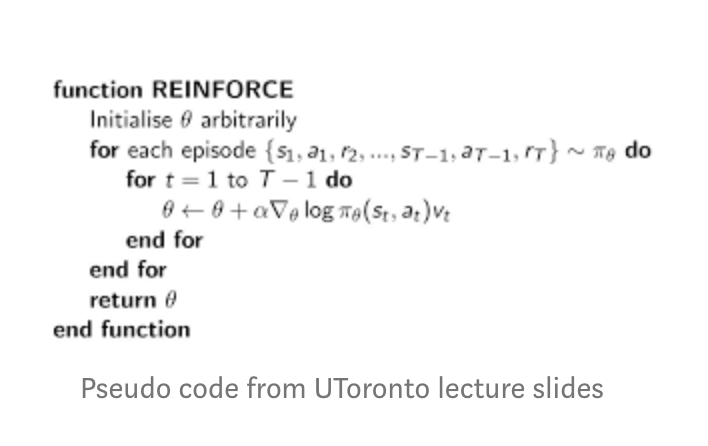
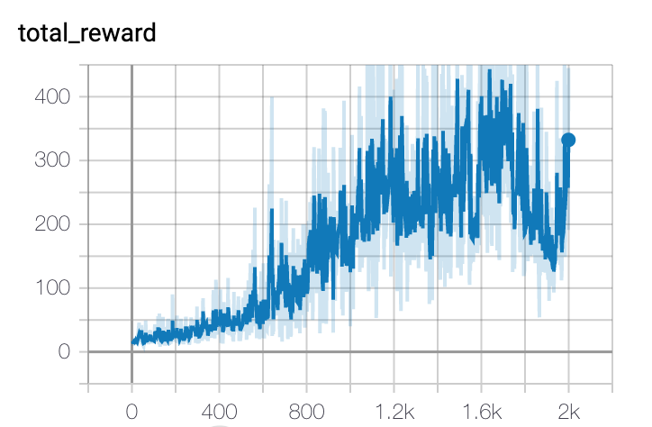

# Implementation of REINFORCE with PyTorch Lightning

The links to look at (*great thanks to all these people*):

- [REINFORCE+A2C (google colab)](https://colab.research.google.com/github/yfletberliac/rlss-2019/blob/master/labs/DRL.01.REINFORCE%2BA2C.ipynb#scrollTo=aNH3udIuyFgK)
- [DQN example with Pytorch-Lightning (google colab)](https://colab.research.google.com/drive/1F_RNcHzTfFuQf-LeKvSlud6x7jXYkG31#scrollTo=7uQVI-xv9Ddj)
- [REINFORCE implementation from Medium](https://medium.com/@thechrisyoon/deriving-policy-gradients-and-implementing-reinforce-f887949bd63)
- [Quick start with PyTorch Lightning](https://pytorch-lightning.readthedocs.io/en/latest/new-project.html)
- [Actor-Critic Implementation of *higgsfield*](https://github.com/higgsfield/RL-Adventure-2/blob/master/1.actor-critic.ipynb)
- [DRL book - second edition - A2C on a pong game](https://github.com/PacktPublishing/Deep-Reinforcement-Learning-Hands-On-Second-Edition/blob/master/Chapter12/02_pong_a2c.py)

## REINFORCE algorithm

The flow of REINFORCE algorithm is:

1. Perform a trajectory roll-out using the current policy
2. Store log probabilities (of policy) and reward values at each step
3. Calculate discounted cumulative future reward at each step
4. Compute policy gradient and update policy parameter
5. Repeat 1–4

## My Implementation

The main code of the implementation is in 
[REINFORCE.py](REINFORCE.py).
There we have 3 objects:
- Model(nn.Module) - the model itself
- RLDataset(torch.utils.data.IterableDataset) - the object that creates
the flow of the game (one epoch at the time)
- REINFORCELightning(pl.LightningModule) - actual Lightning
Model that constructs the process of learning

###The graph of total rewards:

